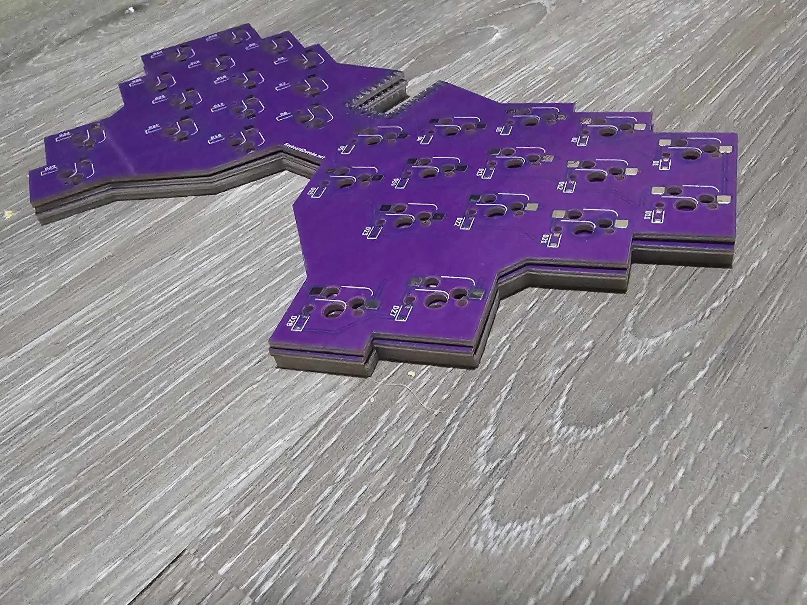

# Goober
# Project is sponsored by PCBWay!

If you're not familiar with PCBWay, they're a fantastic company specializing in PCB prototyping and manufacturing. Whether you're a hobbyist or a professional, PCBWay offers high-quality PCB services at incredibly affordable prices. They offer a wide selection of colors and other options like assembly!

I've been using PCBWay for my projects, and I can't recommend them enough. Their user-friendly interface makes it easy to upload your designs, and their fast turnaround times ensure you get your PCBs quickly. Plus, they offer a wide range of services, including PCB assembly, flexible PCBs, and even 3D printing and CNC!

Head on over to [PCBWay](pcbway.com) to get yourself a Goober!

# About The Goober
The goober is a 30 key hot swappable Hummingbird-like Keyboard using the RP2040 Zero for the MCU. This was designed to be caseless, although you are welcome to use the files in this repo to have a case 3D printed. Named the Goober because only a goober would use one. It is a very goofy keyboard. The thumbs keys are super "tucky" and it is awkward to figure out a layout. But once you get used to it, it just might become your favorite keyboard!

The keyboard runs on VIAL QMK firmware.

