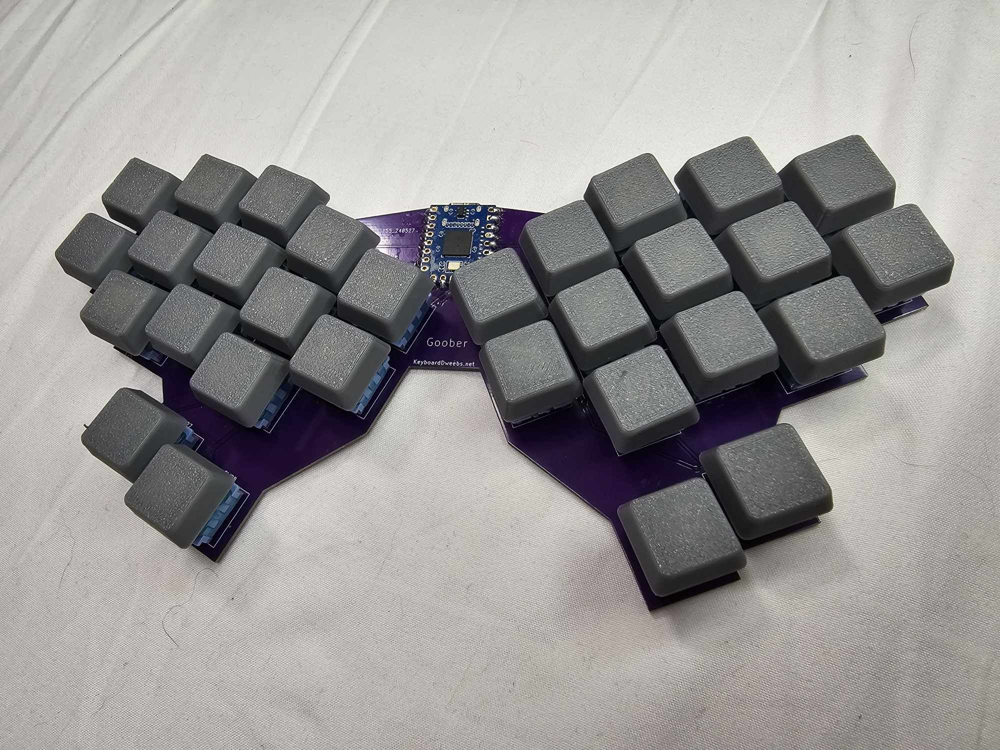

# Goober
The goober is a 30 key Hummingbird-like Keyboard using the RP2040 Zero for the MCU. Named the Goober because only a goober would use one. It is a very goofy keyboard. The thumbs keys are super "tucky" and it is awkward to figure out a layout. But once you get used to it, it just might become your favorite keyboard!

The keyboard runs on VIAL QMK firmware.

# Project is sponsored by PCBWay!

If you would like to make one of your own, head on over to PCBway.com and get yourself a Goober.
